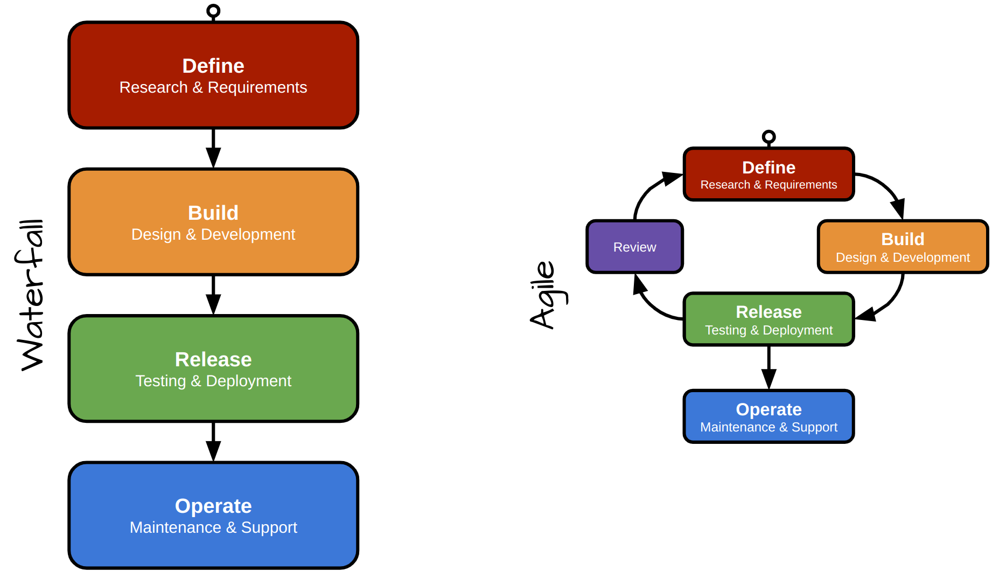
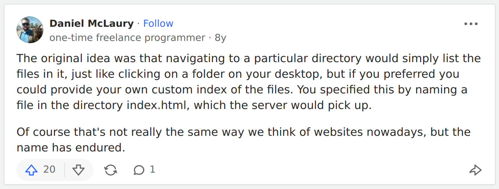

# Designing Systems

0.  Follow-ups from [week 2: working with data](https://github.com/musa-611-fall-2022/week2)
    - Portfolios?
    - Demonstration of node, when to use it (linting, serving files), and when not to (running your JS that's meant for the browser)
    - Understanding what your code editor is telling you (syntax coloring)
    
    **BUT THAT'S ALL AFTER...**

1.  Framing your system (before your first line of code)
    - Put together a product requirements document
    - Waterfall vs Agile
      
1.  Laying out your code (folder structure)
    - _index.html_ file, and [why it's special](https://qr.ae/pvOhOA)
      
    - CSS and JavaScript files
1.  Putting a map on the page
    - What to know in the HTML (the map container)
    - What to know in the CSS (ID selector, no inherent height)
    - What to know in the JS
1.  Putting data on the map
    - 30 Days of JavaScript 5-9 ... _VERY HIGH LEVEL_ overview.
    - Let's work with a real data set
      - You've already contributed to a dataset (class dossier)
      - We'll explore some information about schools in Philadelphia ... but we'll talk about it first
        - A couple sources: [OpenDataPhilly](https://opendataphilly.org/organization/school-district-of-philadelphia), or the [School District of Philadelphia](https://www.philasd.org/performance/programsservices/open-data/school-information/)
        - Aggregating data (counting, summing, ...)
        - Iterating over data (but why 🤔?)
        - Filtering data
        - Transforming data (e.g., adding new fields)
        - Sorting data
1.  Introducing form elements
1.  Laying out a page
    - The CSS box model, flex box, grid
    - Manipulating styles in the developer tools
      * Let's have a bit of fun with https://www.nytimes.com/interactive/2022/09/09/climate/growing-wildfire-risk-homes.html

## Project -- School Explorer

See https://github.com/musa-611-fall-2022/school-explorer for instructions.